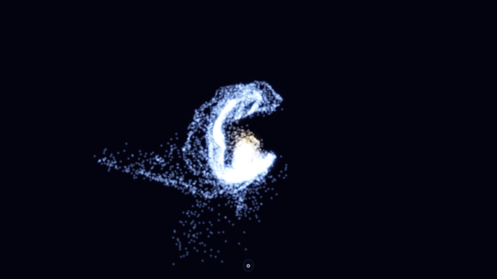

# 🌀 Spiral Galaxy

A GPU-accelerated **self-gravitating N-body** simulation: ~16,000 bodies where every star pulls on every other, set up as a cold rotating disk that spontaneously grows **spiral arms**. A live disk-temperature slider lets you dial between a smooth disk, churning spiral arms, and a clumpy fragmenting one. Written in **Rust**, compiled to **WebAssembly**, and rendered with **WebGPU** — it runs entirely in the browser.

**Live:** [galacto.tre.systems](https://galacto.tre.systems/) — needs a WebGPU-capable browser (Chrome / Edge 113+, or Firefox with `dom.webgpu.enabled`).



## Features

- **GPU compute physics** — the all-pairs gravity for every body runs in a WebGPU compute shader (workgroup-tiled); the CPU never touches per-body state.
- **Self-gravity N-body** — every body has mass and attracts every other, so a cold disk swing-amplifies small perturbations into recurrent spiral arms (no scripted texture — real density waves).
- **Live disk-temperature slider** — sets the disk's random velocity dispersion (≈ Toomre Q) and re-seeds on release: cold fragments into clumps, hot is a featureless smear, and the spiral sweet spot is in between.
- **Dark-matter halo** — a static logarithmic halo binds the disk (nothing escapes) and sets a flat outer rotation curve.
- **Rust → WebAssembly** — the core compiles to WASM for near-native speed.
- **Interactive 3D camera** — orbit, pan, zoom, pause, and reset, with mouse, keyboard, and touch.
- **Adjustable speed** — an on-screen slider scales the simulation up to ~100× so the arms develop in seconds. The top end is GPU-bound (all-pairs gravity is heavy, so the frame rate drops), but the fixed timestep keeps the physics correct.
- **Edge-deployed** — ships as a static site on Cloudflare Pages.

## Controls

### Desktop

| Input              | Action                              |
| ------------------ | ----------------------------------- |
| **Left-drag**      | Rotate (orbit) the camera           |
| **Right-drag**     | Pan the camera                      |
| **Mouse wheel**    | Zoom in and out                     |
| **Spacebar**       | Pause / resume the simulation       |
| **R**              | Reset the camera                    |
| **Speed slider**   | Scale simulation speed (0.25×–100×) |
| **Disk-temp slider** | Set disk temperature; re-seeds on release (0.2 cold/clumpy → 2.0 hot/smooth) |

### Touch

| Input              | Action               |
| ------------------ | -------------------- |
| **One finger**     | Rotate the camera    |
| **Pinch**          | Zoom in and out      |

## Quick Start

### Prerequisites

- **Rust** — install from [rustup.rs](https://rustup.rs/)
- **Node.js** 16+ — for the build scripts
- **A WebGPU browser** — Chrome / Edge 113+, or Firefox with `dom.webgpu.enabled`

### Installation

```bash
git clone https://github.com/tre-systems/galacto.git
cd galacto
npm run setup   # installs deps and adds the wasm32 target
npm run dev     # builds, then serves on http://localhost:8000
```

## Development

### Project Structure

```
galacto/
├── src/                  # Rust source
│   ├── lib.rs            # WASM entry: AppState + requestAnimationFrame loop
│   ├── graphics.rs       # WebGPU initialization
│   ├── simulation.rs     # Buffers, pipelines, galaxy init, compute/render dispatch
│   ├── camera.rs         # Orbit camera → view-projection matrix
│   ├── input.rs          # Mouse / touch / keyboard → camera
│   ├── utils.rs          # Panic hook, console_log!
│   └── shaders/
│       ├── update.wgsl   # Compute: tiled all-pairs self-gravity + symplectic integration
│       └── render.wgsl   # Vertex + fragment: project + radius-based glow
├── static/               # Frontend assets (index.html, styles.css, favicon)
├── docs/                 # Architecture and diagrams
├── scripts/              # Diagram render/check scripts
└── pkg/                  # wasm-pack output (generated, git-ignored)
```

### Key Commands

| Command                 | Description                                      |
| ----------------------- | ------------------------------------------------ |
| `npm run setup`         | Install dependencies and add the WASM target     |
| `npm run build`         | Build the WASM module and copy assets into `pkg/`|
| `npm run dev`           | Build and serve on port 8000                     |
| `npm run deploy`        | Build and deploy to Cloudflare Pages             |
| `npm run test`          | Run Rust tests                                   |
| `npm run lint`          | Run Clippy                                       |
| `npm run format`        | Format with rustfmt                              |
| `npm run diagrams`      | Render the architecture diagrams (needs Graphviz)|

The pre-commit hook runs `cargo fmt --check`, `cargo clippy -- -D warnings`, and `cargo test`; CI runs the same plus a WASM `cargo check` and deploys on push to `main`.

## Architecture


One `requestAnimationFrame` callback updates the camera, then per fixed step runs two GPU **compute** passes — an all-pairs gravity pass that sums each body's acceleration, then an integrate pass that advances it — and issues one instanced **billboard** draw that reads the same buffer. Body state lives only in GPU memory — there is no CPU readback. See [docs/ARCHITECTURE.md](docs/ARCHITECTURE.md) for the full picture.

## Physics

The model is a full **N-body** system: every body has mass and attracts every other (all-pairs gravity, O(N²)). Set up as a cold rotating disk, that self-gravity is what lets **spiral arms** grow — small over-densities are sheared by the disk's differential rotation and self-gravity amplifies them into recurrent, trailing spiral patterns (swing amplification). They're real density waves, not a painted-on texture.

- **All-pairs gravity** — each body's acceleration is the softened sum over every other, `a = Σ G·mⱼ·dⱼ / (|dⱼ|² + ε²)^{3/2}`.
- **Dark-matter halo** — a static logarithmic halo adds an inward pull `a = -v₀²·r / (|r|² + r_c²)`. Its potential is unbounded, so the disk stays bound, with a flat outer rotation curve.
- **Symplectic Euler** — computed in two passes per step (gravity, then integrate): velocity is updated, then position (`v += a·dt; x += v·dt`); this conserves energy far better than plain Euler.
- **Initial disk** — a heavy central bulge plus an exponential disk of stars on near-circular prograde orbits, each given a random thermal kick scaled by the disk-temperature slider. The dispersion (≈ Toomre Q) decides the outcome: too cold fragments into clumps, too hot stays a smooth smear, and the spiral arms live in between. Moving the slider re-seeds the disk so you can sweep through all three.

Everything derives from a fixed RNG seed, so a given temperature always evolves the same way.

Everything derives from a fixed RNG seed, so each load looks the same.

## Documentation

- [Architecture](docs/ARCHITECTURE.md) — how the code is organized and how one frame is produced
- [Diagrams](docs/diagrams/README.md) — Graphviz system-overview and frame-loop diagrams
- [Backlog](BACKLOG.md) — ordered next work and known constraints
- [Agent Notes](AGENTS.md) — workflow, verification, and architecture rules for agents

## Browser Support

| Browser         | Status   | Notes                                         |
| --------------- | -------- | --------------------------------------------- |
| **Chrome/Edge** | ✅ 113+  | WebGPU enabled by default                     |
| **Firefox**     | 🔧 113+  | Enable `dom.webgpu.enabled` in `about:config` |
| **Safari**      | ⚠️ 17.4+ | WebGPU support varies by version              |

## License

MIT License — see [LICENSE](LICENSE).
