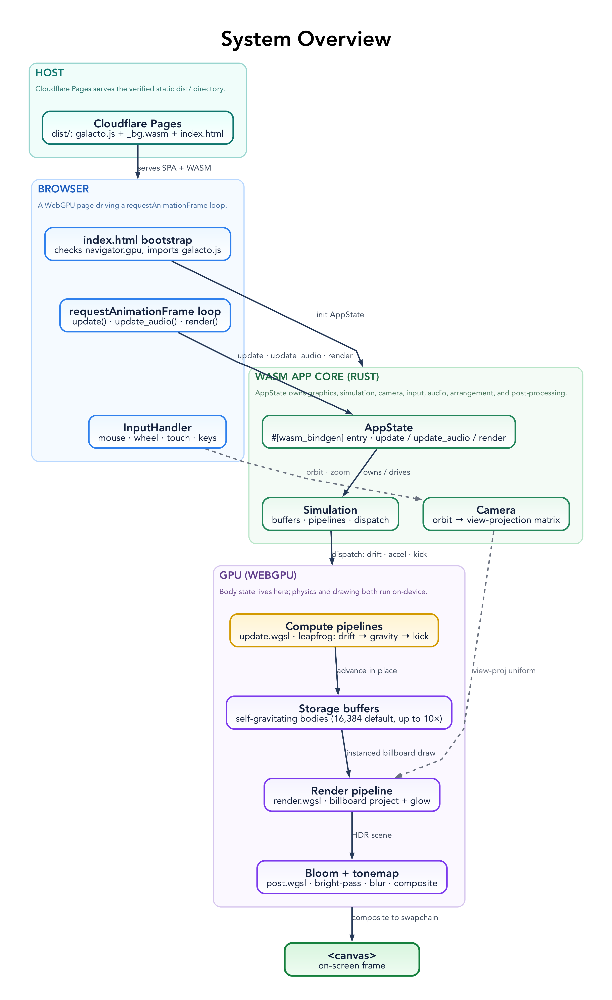
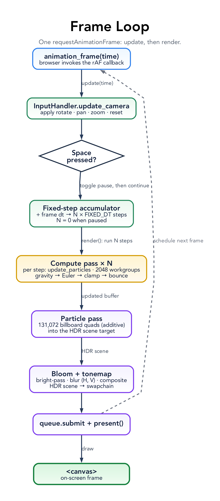

# galacto — Architecture

> Scope: how the code is organized and how one rendered frame is produced. The simulation is small — ~6 Rust modules and 2 WGSL shaders — but it is GPU-first: all per-particle physics runs in a compute shader and never touches the CPU.



## Stack

| Layer            | Choice                          | Notes                                                          |
| ---------------- | ------------------------------- | -------------------------------------------------------------- |
| Language         | Rust (edition 2021)             | ~700 lines across `src/`                                       |
| GPU access       | `wgpu` 24 (WebGPU)              | Compute + render pipelines; `BROWSER_WEBGPU` backend           |
| Shaders          | WGSL                            | `update.wgsl` (compute), `render.wgsl` (vertex + fragment)     |
| Math             | `cgmath`                        | Perspective + look-at for the orbit camera                     |
| WASM bindings    | `wasm-bindgen` + `web-sys`      | Canvas, events, `requestAnimationFrame`, console               |
| Build            | `wasm-pack` (`--target web`)    | Emits `pkg/galacto.js` + `galacto_bg.wasm`                     |
| Host             | Cloudflare Pages                | Serves the static `pkg/` directory                             |
| Scale            | 131,072 particles               | One compute dispatch + one instanced draw per frame            |

The toolchain is plain `stable` (`rust-toolchain.toml`) — no nightly, no `build-std`, no threads.

## Repo Layout

```
src/
├── lib.rs               # WASM entry: AppState owns graphics/sim/camera/input; rAF loop
├── graphics.rs          # WebGPU init: instance → adapter → device/queue → surface → depth texture
├── simulation.rs        # Buffers, pipelines, bind groups, particle init, compute_pass / render_pass
├── camera.rs            # Orbit camera: position, scale, rotation → view-projection matrix
├── input.rs             # Mouse / wheel / touch (pinch) / keyboard → camera; pause + reset
├── utils.rs             # set_panic_hook, console_log! macro
└── shaders/
    ├── update.wgsl      # Compute: gravity + Euler integration + boundary bounce
    └── render.wgsl      # Vertex (project + velocity color) + fragment (brightness/glow)
static/                  # Frontend: index.html (WebGPU check + bootstrap), styles.css, favicon.svg
pkg/                     # wasm-pack output + copied static assets — the deploy root (git-ignored)
scripts/                 # render-diagrams.mjs, check-diagrams.mjs
```

## Patterns

galacto is small, but nearly every file is an instance of one of a handful of recurring patterns. Naming them once makes the rest of the code predictable; the detailed sections below are each an elaboration of one of these.

**GPU-resident state, no readback.** After the initial upload, particle positions and velocities live only in a GPU storage buffer. The compute pass is the sole writer and the render pass the sole reader; the CPU never reads particle data back. The CPU's only per-frame writes are two small uniforms (params, camera).

**Compute-then-render over one buffer — no ping-pong.** The same particle buffer is bound `storage, read_write` to the compute pass and `storage, read` to the render pass within a single command encoder. WebGPU inserts a barrier between the passes, so the render reads exactly what the compute just wrote. Double-buffering (ping-pong) is deliberately absent: nothing reads the buffer *while* it is being written, so a second copy would buy nothing. It would only be needed if a frame both read an old generation and wrote a new one concurrently.

**Owning composition root (`AppState`).** One struct (`src/lib.rs`) owns the four subsystems — `Graphics`, `Simulation`, `Camera`, `InputHandler` — and is the only orchestrator. Each frame it calls `update()` then `render()`. Subsystems never reach for each other; they are wired together only through `AppState`.

**Single `#[wasm_bindgen(start)]` entry + self-scheduling rAF loop.** `start()` is the only WASM export. It installs the panic hook, spawns async initialization, and arms a `requestAnimationFrame` callback that re-arms itself every frame — the render loop is a tail chain of rAF calls, not a timer.

**POD structs mirrored Rust ↔ WGSL.** `Particle` and `SimulationParams` are `#[repr(C)]` + `bytemuck::Pod`, byte-for-byte identical to their WGSL `struct` counterparts, so they `cast_slice` straight into buffers with no serialization. A `_padding: u32` keeps `SimulationParams` 16-byte aligned for a uniform. **The Rust definition and the WGSL definition are one contract and must change together.**

**Upload-once vs upload-per-frame.** Large data that is static after init (the particle buffer) is uploaded once at creation. Small, frequently-changing data (the params and camera uniforms) is pushed every frame with `queue.write_buffer` into `UNIFORM | COPY_DST` buffers.

**Labeled resources.** Every buffer, pipeline, bind group, pass, and texture carries a `label: Some(...)` so it is identifiable in browser GPU debuggers and validation messages.

**Derived visuals in-shader (single source of truth).** Color, brightness, and glow are pure functions of a particle's velocity, computed in the shaders and never stored. Position + velocity is the only state; appearance is recomputed from it each frame, so it can never drift out of sync with the simulation.

**Deferred input: accumulate, then drain.** DOM event handlers write into one shared `InputState` behind an `Rc<RefCell>` (`src/input.rs`). The frame loop reads that state once per frame: it acts on *level* state (is-rotating, is-dragging) and **drains** *edge* state — the pause/reset flags and the accumulated zoom delta are reset as they are consumed. This decouples asynchronous, bursty event delivery from the synchronous once-per-frame update.

**Retained closures keep listeners alive.** Each `add_event_listener` closure is pushed into the handler's `_closures` vector so it is not dropped at the end of setup — dropping it would silently unregister the listener.

**Compile-time-embedded shaders.** WGSL is brought in with `include_str!`, so shaders are compiled into the WASM; there is no runtime fetch or separate asset to deploy.

**Deterministic seeded initialization.** All initial particle state is generated from a fixed RNG seed (`StdRng::seed_from_u64(42)`), so every page load produces an identical starting configuration.

**Single attractor, not N-body.** Particles are attracted only to a fixed mass at the origin — `O(N)` per step — never to each other (`O(N²)`). There is no particle–particle interaction; the disk is an emergent property of many bodies sharing one central field.

**Integrator guard-rails.** The explicit Euler step is kept stable by three guards: a softening epsilon (`r² + 1e-6`) at the singularity, a velocity clamp (max speed), and a `dt` cap. Each one stops a specific way open-form integration can blow up.

**Fallible boundary returns `Result<_, JsValue>`.** Setup that can fail at the JS/GPU boundary (`Graphics::new`, `Simulation::new`) returns `Result<_, JsValue>` and converts errors with `map_err`; the per-frame hot path is infallible. *(Applied unevenly today — see gaps below.)*

### Known consistency gaps

A few places don't yet follow the pattern they belong to; each is tracked in [BACKLOG.md](../BACKLOG.md):

- **Boundary error handling is uneven.** `Graphics::new` propagates most failures as `Result`, but `panic!`s when no GPU adapter is found and `unwrap()`s `window()`/`document()`. Because the panic hook isn't enabled in release, those abort with no message. The pattern wants a uniform `Result<_, JsValue>`.
- **The resize pattern is unwired.** `AppState::resize`, `Graphics::resize`, and `Camera::set_aspect_ratio` implement canvas resize, but nothing calls them — there is no `resize` listener, the canvas is fixed at 1024×768, and the camera aspect stays 1.0 while CSS stretches the canvas to the viewport (so the image is distorted off 4:3 and upscaled on large displays). Either wire a `resize` handler or remove the capability.
- **Not all tunables live in `SimulationParams`.** `dt` and `gm` are in the params uniform, but `max_velocity`, the world `boundary`, the restitution, and the color/brightness constants are hardcoded in the shaders, so the "tunables live in `SimulationParams`" rule holds only partially.
- **Two logging paths.** `start()` initializes the `log` facade (`console_log::init_with_level`), but all logging uses the custom `console_log!` macro that bypasses `log`, leaving the facade as dead weight.

Patterns galacto would benefit from but does not yet use — **fixed-timestep integration**, an **FFI-free core**, and a **non-`unsafe` global** — are described in [BACKLOG.md](../BACKLOG.md).

## How a Frame Is Produced



A single `requestAnimationFrame` callback (`animation_frame` in `src/lib.rs`) does two things on the shared `AppState`:

1. **`update(time)`** — compute `dt` from the frame timestamp, let the `InputHandler` apply pending rotate/pan/zoom/reset to the `Camera`, toggle pause if Space was pressed, and (if not paused) push the current `dt` into the params buffer (`Simulation::update`, which caps `dt` at 0.033 s for stability).
2. **`render()`** — open a command encoder, then:
   - if not paused, run the **compute pass**: dispatch `update_particles` over `ceil(131072 / 64) = 2048` workgroups, advancing every particle in place;
   - run the **render pass**: write the camera's view-projection matrix into the camera uniform, then issue one `draw(0..131072)` of point primitives with depth testing against a `Depth32Float` buffer;
   - submit and `present()`.

Then it schedules the next frame. The simulation state lives only in GPU memory between frames — there is no CPU-side particle array after the initial upload.

## GPU Data Model

`Simulation::new` (`src/simulation.rs`) creates three buffers and two pipelines:

| Resource          | Contents                                          | Usage                                  |
| ----------------- | ------------------------------------------------- | -------------------------------------- |
| Particle buffer   | `131072 × Particle` (`position[3]`, `velocity[3]` — 24 B each, ~3.1 MB) | `STORAGE \| VERTEX \| COPY_DST` |
| Params buffer     | `SimulationParams { dt, gm, particle_count, _padding }` | `UNIFORM \| COPY_DST`            |
| Camera buffer     | 4×4 view-projection matrix (64 B)                 | `UNIFORM \| COPY_DST`                  |

- **Compute bind group** (`@compute` visibility): binding 0 = particle buffer as `storage, read_write`; binding 1 = params as `uniform`.
- **Render bind group** (`@vertex` visibility): binding 0 = camera matrix as `uniform`; binding 1 = the *same* particle buffer as `storage, read`.

The particle buffer is bound as both a compute storage target and a vertex-stage storage input, so the data the compute shader just wrote is exactly what the vertex shader reads — no copies, no staging, no ping-pong. The vertex shader indexes `particles[vertex_index]` directly rather than using a vertex buffer layout.

## Simulation & Physics

All physics is in `src/shaders/update.wgsl`. Per particle, per step:

- **Gravity to a fixed center.** `r² = dot(pos, pos) + 1e-6` (epsilon avoids divide-by-zero at the singularity), then acceleration `a = -gm · pos / r³` toward the origin. `gm` (the gravitational parameter `G·M`) is `40000.0`.
- **Euler integration.** `velocity += a · dt`; speed is clamped to a maximum of `140` to keep fast particles from escaping the integrator; then `position += velocity · dt`.
- **Inelastic boundary.** At `|x|`, `|y|`, or `|z|` past `600`, the position is clamped to the wall and that velocity component is reflected and damped to `−0.1×` (≈90 % energy loss). This is a *bounce*, not an elastic collision — it bleeds energy so particles settle rather than ricochet forever.

Initial conditions (`Simulation::generate_initial_particles`, seeded `StdRng(42)` → reproducible):

- **~500 close-orbit stars** scattered in a vertically flattened sphere (radius 20–80) around the hole, each given a roughly tangential velocity `sqrt(gm / r) · 0.8` (slightly sub-orbital) so they trace short arcs near the center.
- **The remaining ~130,572 particles** are seeded as a single injected **stream** — all starting near `(10, y, 100)` with `y ∈ [−150, 150]` and a uniform `velocity = (150, 0, 0)` — which the central gravity then sweeps into the disk. This stream, not Keplerian orbits, is what produces the bulk of the motion.

## Rendering

`src/shaders/render.wgsl` draws each particle as a single GPU point:

- **Vertex** — transform `position` by the camera matrix to clip space; compute `normalized_speed = min(|velocity| / 200, 1)` and a color ramp blue (slow) → red (fast): `color = (speed·2, 0.1, 1 − speed)`.
- **Fragment** — scale color by a speed-dependent `brightness = 3 + speed·8` and add a reddish `glow`, output at alpha `0.9`.

The pipeline uses `PointList` topology, `ALPHA_BLENDING`, and depth testing (`Depth32Float`, `Less`, depth-write on) so nearer particles occlude farther ones. The pass clears to a near-black blue `(0.01, 0.01, 0.05)`.

## Camera & Input

`Camera` (`src/camera.rs`) is an orbit camera: it keeps a `scale` (zoom), `rotation_x` / `rotation_y`, and an aspect ratio, and places the eye at `distance = 800 / scale` rotated around the origin, always looking at `(0,0,0)` through a 45° perspective (near 0.1, far 5000). It starts rotated 90° horizontally and zoomed in (`scale = 3.0`); `rotation_x` is clamped to ±1.5 rad and `scale` to 0.3–5.0.

`InputHandler` (`src/input.rs`) registers DOM listeners and translates them into camera intent, polled once per frame:

| Input                         | Action            |
| ----------------------------- | ----------------- |
| Left-drag / one-finger drag   | Rotate (orbit)    |
| Right-drag                    | Pan               |
| Wheel / two-finger pinch      | Zoom              |
| Space                         | Pause / resume    |
| R                             | Reset camera      |

## Build & Deploy

- `npm run build` → `wasm-pack build --target web --release --out-name galacto --no-opt`, then `cp -r static/* pkg/`. Output is `pkg/` (git-ignored, regenerated).
- `npm run dev` → build, then `serve pkg -l 8000`. Open in a WebGPU-capable browser.
- `npm run deploy` → build, then `wrangler pages deploy pkg --project-name=galacto`.
- CI (`.github/workflows/ci-cd.yml`) runs the verification gate on every push/PR and deploys `pkg/` to Cloudflare Pages on push to `main`. The Pages project name lives only in the deploy command; there is no `wrangler.toml`.

## What This Architecture Deliberately Does Not Include

- **No server or persistence.** Everything runs client-side; there is no backend or save state.
- **No CPU physics.** All per-particle work is on the GPU; the CPU only sets `dt`, the camera, and pause state. The particle buffer is never read back.
- **No threads.** The WASM is single-threaded — no `rayon`, no `SharedArrayBuffer`. It therefore needs **no** cross-origin-isolation (COOP/COEP) headers; the site ships without a `_headers` file.
- **No N-body gravity.** Particles are attracted only to one fixed central mass (O(N) per step), not to each other (which would be O(N²)). There is no particle–particle interaction.
- **No WebGL fallback.** The renderer targets WebGPU; `index.html` checks for it up front and shows a "WebGPU not supported" message rather than degrading.
